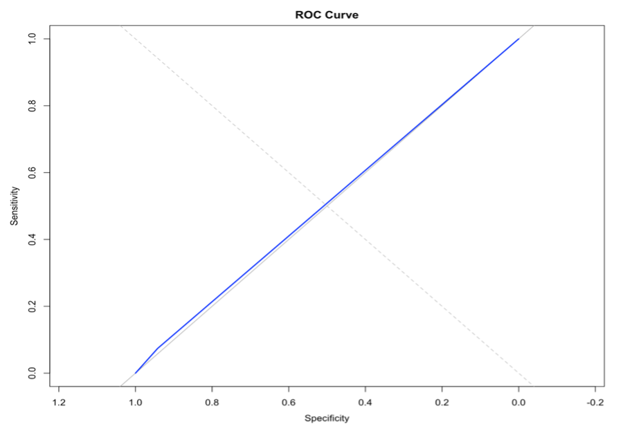
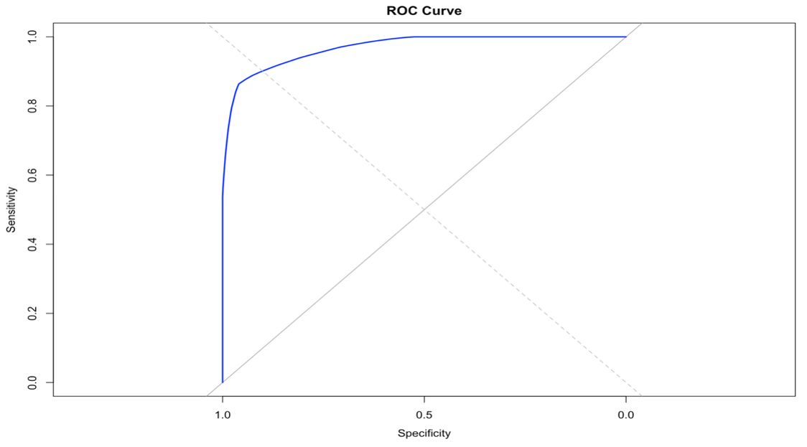
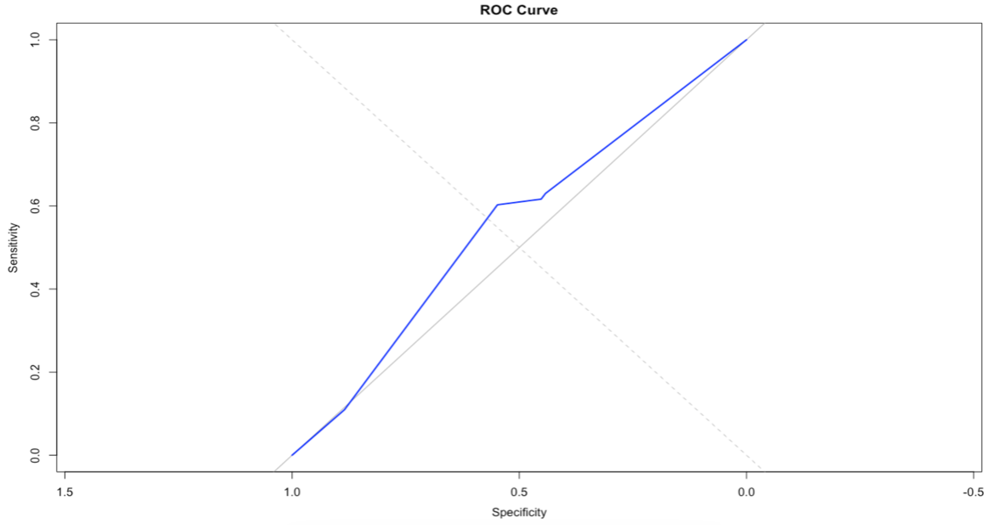

## This code is running using R notebook in RStudio

### The Problem

Water is very important to the continuity of life and is one of the six essential nutrients (carbohydrates, protein, fat, vitamins, and minerals). Approximately 70% of the plants are covered with water, but only 2.5% are suitable for drinking or cultivation. As humans use more water, it's getting harder to find water for consumption, whether it's because of fertilizers, industrial pollution, or excessive usage of water, which causes the groundwater reservoirs in densely populated cities to shrink. And with increasing population density, we need more water and food, so one of the solutions is water desalination to make it potable. In order to assess quality Potability , which is the suitability of water for human consumption, we need quality measurements and assessments.

### Goals:

We are collecting a dataset on water quality to train a machine learning model for binary classification: determining whether water is safe for consumption (1) or not (0). This model will help with water treatment decisions and ensure compliance with quality standards. We applied different Summarzition and plotting methods to help us to understand our dataset, such as scatter, histogram and bar plot. Then, we applyed preprocess in our data using data cleaning, data transformation and feature selection.

### Classification and Clustering Goal:

1-classification in this dataset is to build a predictive model that can classify water samples into two categories: potable (suitable for consumption) or non-potable (not suitable for consumption).

2-clustering in this dataset is to identify natural groupings or clusters within the water samples based on their quality parameters.

###Data

### Source of the dataset:

Kaggle

### Link of the dataset:

[Water Quality and Potability](https://www.kaggle.com/datasets/uom190346a/water-quality-and-potability)

### Information about the dataset

it is contains 10 attributes, 3276 objects, and the class label for our dataset is Potability.

### Attribute information

+-----------------+-------------------------------+---------------+-----------------+
| Attribute       | Description                   | Data Type     | Possible Values |
+=================+===============================+===============+=================+
| ph              | pH level of water             | decimal       | 0-14            |
+-----------------+-------------------------------+---------------+-----------------+
| Hardness        | Water hardness in water       | decimal       | 47.4-323        |
+-----------------+-------------------------------+---------------+-----------------+
| Solids          | Dissolved solids in water     | decimal       | 321-61.2k       |
+-----------------+-------------------------------+---------------+-----------------+
| Chloramines     | Chloramines concentration     | decimal       | 0.35-13.1       |
+-----------------+-------------------------------+---------------+-----------------+
| Sulfate         | Sulfate concentration         | decimal       | 129-481         |
+-----------------+-------------------------------+---------------+-----------------+
| Conductivity    | Electrical conductivity       | decimal       | 181-753         |
+-----------------+-------------------------------+---------------+-----------------+
| Organic_carbon  | Organic carbon content        | decimal       | 2.2-28.3        |
+-----------------+-------------------------------+---------------+-----------------+
| Trihalomethanes | Trihalomethanes concentration | decimal       | 0.74-124        |
+-----------------+-------------------------------+---------------+-----------------+
| Turbidity       | Turbidity level               | decimal       | 1.45-6.74       |
+-----------------+-------------------------------+---------------+-----------------+
| Potability      | Indicates water potability    | boolean       | 0-1             |
+-----------------+-------------------------------+---------------+-----------------+

# library:

```{r}
#install.packages("caret")
#install.packages("glmnet")
#install.packages("Boruta")
#install.packages("mlbench")
#install.packages("randomForest")
library(cluster)
library(factoextra) 
library(outliers)
library(dplyr)
library(mlbench)
library(caret)
library(glmnet)
library(Boruta)
library(ggplot2)
library(randomForest)
library(pROC)
library(e1071)
library(caret)
library(party)
library(partykit)
library(RWeka)
library(C50)
library(printr)
library(rpart)
library(rpart.plot)

#getwd()
```

```{r}
water_potability = read.csv('Dataset/water_potability.csv')

str(water_potability)
```

### sample of data

sample of raw dataset(first 10 rows):

```{r}

head(water_potability,10)
```

sample of raw dataset(last 10 rows):

```{r}
tail(water_potability, 10)
```

Five number summary of each attribute in our dataset:

```{r}
summary(water_potability)
```

#### Sample of Water_potability dataset

This is a sample of the dataset to help to understand how it is structured and organized

```{r}
sample(water_potability)
```

### Number of column and rows

```{r}
dim(water_potability)
```

### Checking for missing values:

The absence of data in certain variables or columns in a dataset is referred to as missing or null values due to various reasons. It can have a negative impact on the dataset's efficiency and the information that can be taken from it later, so we checked to see whether our data had missing or null values and eliminated these rows to produce a more efficient dataset.

first we checked for missing value to ensures accurate statistics, reliable visualizations, and guides decisions on imputation or removal of missing data.

```{r}
dim(water_potability)
sum(is.na(water_potability))
```

### Remove rows with missing values

```{r}
colSums(is.na(water_potability))
water_potability = na.omit(water_potability)
```

#### Second remove NA rows

```{r}
colSums(is.na(water_potability))
```

### Standard deviation:

The standard deviation in statistics is a measure used to assess the spread of data around the mean. It gives us an idea of how much the data points deviate from the average.

```{r}
sd(water_potability$Turbidity)
sd(water_potability$Solids)
sd(water_potability$Conductivity)
sd(water_potability$Organic_carbon)
sd(water_potability$ph)
```

we ues it for five coulme Turbidity,Solids,Conductivity,Organic_carbon,ph.

### Mean:

the average, is a measure of central tendency in statistics. It is calculated by summing up all the values in a dataset and dividing by the number of values. The mean gives us a representative value that is typically used to describe the "typical" value in a set of data.

```{r}
mean(water_potability$Turbidity)
mean(water_potability$Solids) 
mean(water_potability$Conductivity) 
mean(water_potability$Organic_carbon) 
mean(water_potability$ph) 
```

we ues it for five coulme Turbidity,Solids,Conductivity,Organic_carbon,ph.

### Median:

It represents the middle value in a dataset when the values are arranged in ascending or descending order.

```{r}
median(water_potability$Turbidity)
median(water_potability$Solids)
median(water_potability$Conductivity)
median(water_potability$Organic_carbon)
median(water_potability$ph)
```

we ues it for five coulme Turbidity,Solids,Conductivity,Organic_carbon,ph.

### Variance:

It provides information about how far each value in the dataset is from the mean. A higher variance indicates a greater spread of data, while a lower variance suggests that the data points are closer to the mean.

```{r}
var(water_potability$Turbidity)
var(water_potability$Solids)
var(water_potability$Conductivity)
var(water_potability$Organic_carbon)
var(water_potability$ph)
```

As you can see the highest Variance Solids, and the lowest Turbidity.

### Statistical Measures:

### In the given code, you've used the summary function to obtain key statistical measures for variables such as "Conductivity," "Organic_carbon," "Hardness," etc., in the water_potability dataset. These measures include minimum, 1st quartile, median, mean, 3rd quartile, and maximum values, offering a succinct overview of each variable's distribution and characteristics. This provides essential insights for the initial exploration and understanding of the dataset.

With using minimum, maximum, mean, median laws it helps to provide an overview of the data's key characteristics

```{r}
summary(water_potability$Conductivity)
summary(water_potability$Organic_carbon)
summary(water_potability$Hardness)
summary(water_potability$Solids)
summary(water_potability$Chloramines)
summary(water_potability$Potability)
summary(water_potability$Sulfate)
summary(water_potability$Trihalomethanes)
summary(water_potability$Turbidity)
summary(water_potability$ph)
```

## Data Preprocessing :

### Data Transformation:

The process of converting or modifying raw data into a different format or structure to make it more suitable for analysis or modeling

This step involved transforming the class label, Potability, into categorical data. We changed the numeric data to 'Not Potable' and 'Potable' to indicate whether the water is safe for human consumption, where 1 represents 'Potable', and 0 represents 'Not Potable.

```{r}
water_potability$Potability[water_potability$Potability == '0'] <- 'Not Potable'
water_potability$Potability[water_potability$Potability == '1'] <- 'Potable'

water_potability$Potability <- as.factor(water_potability$Potability)
table(water_potability$Potability)

```

```{r}
print(water_potability)
```

the ROSE package to address class imbalance in a binary classification scenario with a 'Potability' target variable. The code converts 'Potability' to a factor, performs oversampling on the minority class using the ovun.sample function, and displays the balanced dataset alongside the original for a comparison of class distributions. This preprocessing step enhances model generalization by ensuring better representation of the minority class during training. The oversampling is applied to all features except the target variable.

### Outliers:

They are observations that lie far away from the majority of the data. Outliers can occur due to various reasons such as measurement errors, experimental anomalies, or genuine extreme values.

#### before removing outlier:

```{r}
dim(water_potability)
head(water_potability)
```

#### removing outliers:

Removing outliers from a dataset is critical for assuring the quality and reliability of statistical analysis and machine learning models. We found all outliers in the numerical attributes and subsequently eliminated the rows containing the outliers.

### -ph

```{r}
summary(water_potability$ph)
quartiles <- quantile(water_potability$ph, probs = c(.25, .75), na.rm = FALSE)
quartiles
iqr <- IQR(water_potability$ph)
iqr
lower <- quartiles[1] - 1.5*iqr
lower
upper <- quartiles[2] + 1.5*iqr
upper

boxplot(ph ~ Potability, data = water_potability)

repeat {
  out_val <- boxplot(water_potability$ph, ylab = 'ph')$out
  out_val
  out_rows <- which(water_potability$ph %in% c(out_val))
  out_rows
  
  if(sum(out_rows) > 0) water_potability <- water_potability[-out_rows,]
  else {break}
}
summary(water_potability$ph)

#-------------------------------------------
```

### -Hardness

```{r}
summary(water_potability$Hardness)
quartiles <- quantile(water_potability$Hardness, probs = c(.25, .75), na.rm = FALSE)
quartiles
iqr <- IQR(water_potability$Hardness)
iqr
lower <- quartiles[1] - 1.5*iqr
lower
upper <- quartiles[2] + 1.5*iqr
upper

boxplot(Hardness ~ Potability, data = water_potability)

repeat {
  out_val <- boxplot(water_potability$Hardness, ylab = 'Hardness')$out
  out_val
  out_rows <- which(water_potability$Hardness %in% c(out_val))
  out_rows

  if(sum(out_rows) > 0) water_potability <- water_potability[-out_rows,]
  else {break}
}
summary(water_potability$Hardness)

#-------------------------------------------
```

### -Solids

```{r}
summary(water_potability$Solids)
quartiles <- quantile(water_potability$Solids, probs = c(.25, .75), na.rm = FALSE)
quartiles
iqr <- IQR(water_potability$Solids)
iqr
lower <- quartiles[1] - 1.5*iqr
lower
upper <- quartiles[2] + 1.5*iqr
upper

boxplot(Solids ~ Potability, data = water_potability)

repeat {
  out_val <- boxplot(water_potability$Solids, ylab = 'Solids')$out
  out_val
  out_rows <- which(water_potability$Solids %in% c(out_val))
  out_rows

  if(sum(out_rows) > 0) water_potability <- water_potability[-out_rows,]
  else {break}
}
summary(water_potability$Solids)

#-------------------------------------------
```

### -Chloramines

```{r}
summary(water_potability$Chloramines)
quartiles <- quantile(water_potability$Chloramines, probs = c(.25, .75), na.rm = FALSE)
quartiles
iqr <- IQR(water_potability$Chloramines)
iqr
lower <- quartiles[1] - 1.5*iqr
lower
upper <- quartiles[2] + 1.5*iqr
upper

boxplot(Chloramines ~ Potability, data = water_potability)

repeat {
  out_val <- boxplot(water_potability$Chloramines, ylab = 'Chloramines')$out
  out_val
  out_rows <- which(water_potability$Chloramines %in% c(out_val))
  out_rows

  if(sum(out_rows) > 0) water_potability <- water_potability[-out_rows,]
  else {break}
}
summary(water_potability$Chloramines)

#-------------------------------------------

```

### -Sulfate

```{r}
summary(water_potability$Sulfate)
quartiles <- quantile(water_potability$Sulfate, probs = c(.25, .75), na.rm = FALSE)
quartiles
iqr <- IQR(water_potability$Sulfate)
iqr
lower <- quartiles[1] - 1.5*iqr
lower
upper <- quartiles[2] + 1.5*iqr
upper

boxplot(Sulfate ~ Potability, data = water_potability)

repeat {
  out_val <- boxplot(water_potability$Sulfate, ylab = 'Sulfate')$out
  out_val
  out_rows <- which(water_potability$Sulfate %in% c(out_val))
  out_rows

  if(sum(out_rows) > 0) water_potability <- water_potability[-out_rows,]
  else {break}
}
summary(water_potability$Sulfate)

#-------------------------------------------

```

### -Conductivity

```{r}
summary(water_potability$Conductivity)
quartiles <- quantile(water_potability$Conductivity, probs = c(.25, .75), na.rm = FALSE)
quartiles
iqr <- IQR(water_potability$Conductivity)
iqr
lower <- quartiles[1] - 1.5*iqr
lower
upper <- quartiles[2] + 1.5*iqr
upper

boxplot(Conductivity ~ Potability, data = water_potability)

repeat {
  out_val <- boxplot(water_potability$Conductivity, ylab = 'Conductivity')$out
  out_val
  out_rows <- which(water_potability$Conductivity %in% c(out_val))
  out_rows

  if(sum(out_rows) > 0) water_potability <- water_potability[-out_rows,]
  else {break}
}
summary(water_potability$Conductivity)

#-------------------------------------------
```

### -Organic_carbon

```{r}
summary(water_potability$Organic_carbon)
quartiles <- quantile(water_potability$Organic_carbon, probs = c(.25, .75), na.rm = FALSE)
quartiles
iqr <- IQR(water_potability$Organic_carbon)
iqr
lower <- quartiles[1] - 1.5*iqr
lower
upper <- quartiles[2] + 1.5*iqr
upper

boxplot(Organic_carbon ~ Potability, data = water_potability)

repeat {
  out_val <- boxplot(water_potability$Organic_carbon, ylab = 'Organic_carbon')$out
  out_val
  out_rows <- which(water_potability$Organic_carbon %in% c(out_val))
  out_rows

  if(sum(out_rows) > 0) water_potability <- water_potability[-out_rows,]
  else {break}
}
summary(water_potability$Organic_carbon)

#-------------------------------------------
```

### -Trihalomethanes

```{r}
summary(water_potability$Trihalomethanes)
quartiles <- quantile(water_potability$Trihalomethanes, probs = c(.25, .75), na.rm = FALSE)
quartiles
iqr <- IQR(water_potability$Trihalomethanes)
iqr
lower <- quartiles[1] - 1.5*iqr
lower
upper <- quartiles[2] + 1.5*iqr
upper

boxplot(Trihalomethanes ~ Potability, data = water_potability)

repeat {
  out_val <- boxplot(water_potability$Trihalomethanes, ylab = 'Trihalomethanes')$out
  out_val
  out_rows <- which(water_potability$Trihalomethanes %in% c(out_val))
  out_rows

  if(sum(out_rows) > 0) water_potability <- water_potability[-out_rows,]
  else {break}
}
summary(water_potability$Trihalomethanes)

#-------------------------------------------
```

### -Turbidity

```{r}
summary(water_potability$Turbidity)
quartiles <- quantile(water_potability$Turbidity, probs = c(.25, .75), na.rm = FALSE)
quartiles
iqr <- IQR(water_potability$Turbidity)
iqr
lower <- quartiles[1] - 1.5*iqr
lower
upper <- quartiles[2] + 1.5*iqr
upper

boxplot(Turbidity ~ Potability, data = water_potability)

repeat {
  out_val <- boxplot(water_potability$Turbidity, ylab = 'Turbidity')$out
  out_val
  out_rows <- which(water_potability$Turbidity %in% c(out_val))
  out_rows

  if(sum(out_rows) > 0) water_potability <- water_potability[-out_rows,]
  else {break}
}
summary(water_potability$Turbidity)
```

### After removing outliers:

```{r}
dim(water_potability)
str(water_potability)
head(water_potability)
```

### Checking for imbalanced dataset:

```{r}
class_distribution <- table(water_potability$Potability)
print(class_distribution)

# Check if the dataset is balanced
is_balanced <- diff(class_distribution) == 0
if (is_balanced) {
  print("The dataset is balanced.")
} else {
  print("The dataset is imbalanced.")
}
```

```{r}
boxplot(water_potability$ph, ylab = 'ph')$out
boxplot(water_potability$Chloramines, ylab = 'Chloramines')$out
boxplot(water_potability$Hardness, ylab = 'Hardness')$out
boxplot(water_potability$Solids, ylab = 'Solids')$out
boxplot(water_potability$Sulfate, ylab = 'Sulfate')$out
boxplot(water_potability$Conductivity, ylab = 'Conductivity')$out
boxplot(water_potability$Organic_carbon, ylab = 'Organic_carbon')$out
boxplot(water_potability$Trihalomethanes, ylab = 'Trihalomethanes')$out
boxplot(water_potability$Turbidity, ylab = 'Turbidity')$out
```

## Charts:

visual representation of data that help us understand and analyze information more easily. They can be used to display trends, comparisons, and relationships between different variables. There are various types of charts, such as

### Histogram

The histogram shows the frequency of ph in the dataset; we noted that the majority of values fall within the usual range, which is about between 6 and 8, but it also shows several outliers.

```{r}
hist(water_potability$ph)
hist(water_potability$Chloramines)
hist(water_potability$Hardness)
hist(water_potability$Solids)
hist(water_potability$Sulfate)
hist(water_potability$Conductivity)
hist(water_potability$Organic_carbon)
hist(water_potability$Trihalomethanes)
hist(water_potability$Turbidity)
```

### Bar Plot

the bar plot represent how ph levels affect water portability in the dataset it indicates that ph level above 10 is not portibal and humans cant consume it

```{r}
tab <- water_potability$Potability %>% table()
txt <- paste0(tab) 
bb <- water_potability$ph %>% table() %>% barplot( main='ph',col=c('pink'))
bb <- water_potability$Potability %>% table() %>% barplot( main='Potability',ylab='Frequency',col=c('pink', 'lightblue'))
text(bb, tab/2, labels=txt, cex=1)

```

### Scatter Plot

This scatter demonstrates the correlation and proportionality between the two qualities, allowing us to establish whether or not turbidity and pH are connected.

```{r}
with(water_potability, plot(Trihalomethanes, ph, col = Potability, pch = as.numeric(Potability)))
```

### Remove Redundant Features:

This will find the correlation between the features and represent it in heat map

```{r}
correlation_matrix <- cor(water_potability[,1:9])
high_correlation_features <- findCorrelation(correlation_matrix, cutoff = 0.5)
print(high_correlation_features)
```

### Heatmap:

A powerful visualization tool that allows for a quick and intuitive interpretation of the relationships between numeric variables. It provides valuable insights into the structure and dependencies within your dataset.

```{r}
heatmap(correlation_matrix)

```

we remove the correlation between the features and represent it in heat map

### Feature selection:

### Feature selection is deemed unnecessary for our dataset, as each attribute is deemed to provide crucial, distinct information related to the chosen variable. The reasoning behind this decision is that eliminating any attribute through feature selection could potentially lead to the loss of vital data. Additionally, certain machine learning algorithms possess the capability to identify intricate interactions and attribute correlations. By including all variables in the model, we aim to enable the learning and exploitation of complex patterns within the dataset, potentially enhancing predictive performance, especially considering the dataset's substantial size with 10 columns

it is choosing the most relevant features from a dataset to enhance model performance, reduce overfitting, and improve computational efficiency.

Ranking features by importance is a technique used to identify the most influential variables in a dataset for predicting a target variable. This process helps understand which features impact the model's performance most by ranking features by importance.

Removing redundant features means eliminating variables or features from a dataset that do not provide additional or unique information.

### Rank Features By Importance:

ranking features by importance is a technique used to identify the most influential variables in a dataset for predicting a target variable. This process helps in understanding which features have the most impact on the model's performance. By ranking features by importance.

```{r, warning=FALSE}
#train random forest model and calculate feature importance
rf = randomForest(x= water_potability[,1:9],y= water_potability[,10])
var_imp <- varImp(rf, scale = FALSE)
#sort the score in decreasing order
var_imp_df <- data.frame(cbind(variable = rownames(var_imp), score = var_imp[,1]))
var_imp_df$score <- as.double(var_imp_df$score)
var_imp_df[order(var_imp_df$score,decreasing = TRUE),]

ggplot(var_imp_df, aes(x=reorder(variable, score), y=score)) + 
  geom_point() +
  geom_segment(aes(x=variable,xend=variable,y=0,yend=score)) +
  ylab("IncNodePurity") +
  xlab("Variable Name") +
  coord_flip()
```

### Recursive Feature elimination:

is a feature selection technique that recursively removes less important features from a model until the optimal subset is identified. It involves repeatedly training the model, ranking features based on their importance, and eliminating the least important ones.

```{r}
set.seed(1958)
control <- rfeControl(functions=rfFuncs, method="cv",number=10)
# run the RFE algorithm 
rfe_model <- rfe(x= water_potability[,1:9],y= water_potability[,10], sizes=c(1:9), rfeControl=control) 
# summarize the results 
print(rfe_model) 
# list the chosen features 
predictors(rfe_model) 
# plot the results 
plot(rfe_model, type=c("g", "o"))
```

### Normlization

Normalization refers to the process of scaling variables to have a common range. It helps in comparing variables with different scales.

```{r}
wp<- water_potability
normalize=function(x){return ((x-min(x))/(max(x)))}
wp$Solids=normalize(wp$Solids)
```

The solids attribute will create critical challenges because of the vast and diverted values: min is 320.9, and max is 43195.5, so we normalized the solids between 0 and 1 to make values smaller and more reasonable.

### Discretization:

Discretization is the process of transforming continuous variables into discrete or categorical variables. It can be useful for analyzing data with many unique values or simplifying it.

```{r}

wp$ph= cut(wp$ph, breaks = seq(3,11,by=4),right=FALSE)
wp$Hardness= cut(wp$Hardness, breaks = seq(120,280,by=40),right=FALSE)
wp$Chloramines = cut(wp$Chloramines, breaks = seq(3,11,by=4),right = FALSE)
wp$Sulfate= cut(wp$Sulfate, breaks = seq(220,440,by=44),right=FALSE)
wp$Conductivity= cut(wp$Conductivity, breaks = seq(200,700,by=100),right=FALSE)
wp$Organic_carbon= cut(wp$Organic_carbon, breaks = seq(4,24,by=4),right=FALSE)
wp$Trihalomethanes= cut(wp$Trihalomethanes, breaks = seq(20,110,by=10),right=FALSE)
wp$Turbidity= cut(wp$Turbidity, breaks = seq(1,7,by=2),right=FALSE)

print(wp)
```

Therefore, we transformed the continuous values of the numeric attributes into intervals by dividing the values to fall on one of the possible interval labels by discretization. The values will be meaningful and simpler to classify or perform other methods to help us later in our model. So, In Trihalomethanes, we intervals by dividing the values by 10 to have labels with equal width : [20,30) [30,40) [40,50) [50,60) [60,70) [70,80) [80,90) [90,100) [100,110).

### Encoding

encoding is the process of converting characters or strings into a specific encoding format. Since we don't have a Nominal attribute in our database we couldn't implement it.

```{r}
wp
```

## Classfication and Clustring

#### In our dataset exploration, we employed both supervised and unsupervised learning methodologies through classification and clustering techniques.

For classification, we chose the decision tree algorithm, a recursive approach constructing a tree structure with leaf nodes signifying final decisions. The objective was to predict the class label (potability), with values 0 or 1, based on attributes like pH, Hardness, Solids, Chloramines, Sulfate, Conductivity, Organic_carbon, Trihalomethanes, and Turbidity. The dataset underwent division into training and testing sets for constructing and evaluating the decision tree. Model evaluation encompassed metrics like accuracy and cost-sensitive measures, gauged using a confusion matrix. Our toolkit included packages such as 'party' and 'caret,' incorporating methods like 'sample' for data splitting, 'ctree' for decision tree construction, 'predict' for testing predictions, and 'confusionMatrix' for model evaluation.

In the unsupervised clustering phase, we excluded the class label attribute "potability" and utilized numeric attributes such as pH, Hardness, Solids, Chloramines, Sulfate, Conductivity, Organic_carbon, Trihalomethanes, and Turbidity. Employing the K-means algorithm, clusters were formed, each represented by a center point, and objects were assigned to the nearest cluster. For this phase, we made use of packages such as 'cluster' and 'factoextra,' incorporating methods like 'scale()' for data scaling, 'Kmeans()' for cluster creation.

Cluster validation was performed using the 'silhouette()' method to calculate averages for each cluster. In both supervised and unsupervised techniques, we maintained result consistency by employing the 'set.seed()' method with the same random number when experimenting with different dataset sizes.

# Training technique

In the provided code, we systematically addressed outliers in multiple columns of our dataset. Beginning with a summary of each column's statistics, including quartiles and the interquartile range (IQR), we established outlier detection limits. A visual assessment was conducted using boxplots, categorized by relevant variables such as "Potability." A loop was implemented to iteratively identify and remove outliers in each column, ensuring a robust cleansing process. The final step involved summarizing the columns post-outlier removal, offering insights into the impact on the distribution of each variable. This comprehensive approach was applied uniformly to all dataset columns, promoting consistency in the outlier-handling process.

### Information gain (ID3)

In this R code, the dataset undergoes a process of training and testing using the ID3 algorithm for decision tree classification. The data is successively split into training sets of 70%, 80%, and 90%, with corresponding testing sets of 30%, 20%, and 10%. The decision tree models are trained on these subsets, utilizing features such as pH, hardness, solids, chloramines, sulfate, conductivity, organic carbon, trihalomethanes, and turbidity to predict water potability.

For each split, the decision tree models are evaluated on their respective testing sets, and performance metrics such as confusion matrices and accuracy are computed. Additionally, Receiver Operating Characteristic (ROC) curves are generated, providing insights into the models' discrimination capabilities. The Area Under the Curve (AUC) is calculated as a quantitative measure of model performance. This comprehensive approach enables a systematic exploration of the ID3 decision tree's effectiveness in predicting water potability under varying training and testing scenarios.

Splitting the data set into two subsets: Training(70%) and Testing(30%):

```{r}
set.seed(1958)
ind <- sample(2, nrow(wp), replace = TRUE, prob = c(0.7, 0.3))
train.data <- wp[ind == 1, ]
test.data <- wp[ind == 2, ]
train.data$Potability <- as.factor(train.data$Potability)
test.data$Potability <- as.factor(test.data$Potability)


myFormula <- Potability ~ ph+Hardness+Solids+Chloramines+Sulfate+Conductivity+Organic_carbon+Trihalomethanes+Turbidity
#myFormula <- Potability ~ ph+Hardness+Solids+Chloramines+Sulfate


m.ctree <- ctree(myFormula, data = train.data)
table(predict(m.ctree), train.data$Potability)

print(m.ctree)
plot(m.ctree, type="simple")
plot(m.ctree)


testPred <- predict(m.ctree, newdata = test.data)
result<-table(testPred, test.data$Potability)


co_result <- confusionMatrix(result)
print(co_result)
as.matrix(co_result, what = "classes")
acc <- co_result$overall["Accuracy"]
acc*100


pred_probs <- as.numeric(predict(m.ctree, newdata = test.data, type = "response"))
binary_outcome <- as.numeric(test.data$Potability == "Potable")
# ROC curve
roc_curve <- roc(binary_outcome, pred_probs)
plot(roc_curve, main = "ROC Curve", col = "blue", lwd = 2)
abline(a = 0, b = 1, col = "gray", lty = 2)
# Print AUC
cat("AUC:", auc(roc_curve), "\n")
```

Splitting the data set into two subsets: Training(80%) and Testing(20%):

```{r}

set.seed(1958)
ind <- sample(2, nrow(wp), replace = TRUE, prob = c(0.8, 0.2))
train.data <- wp[ind == 1, ]
test.data <- wp[ind == 2, ]
train.data$Potability <- as.factor(train.data$Potability)

myFormula <- Potability ~ ph+Hardness+Solids+Chloramines+Sulfate+Conductivity+Organic_carbon+Trihalomethanes+Turbidity
#myFormula <- Potability ~ ph+Hardness+Solids+Chloramines+Sulfate


m.ctree <- ctree(myFormula, data = train.data)
table(predict(m.ctree), train.data$Potability)

print(m.ctree)
plot(m.ctree, type="simple")
plot(m.ctree)

testPred <- predict(m.ctree, newdata = test.data)
result<-table(testPred, test.data$Potability)


co_result <- confusionMatrix(result)
print(co_result)
as.matrix(co_result, what = "classes")
acc <- co_result$overall["Accuracy"]
acc*100

pred_probs <- as.numeric(predict(m.ctree, newdata = test.data, type = "response"))
binary_outcome <- as.numeric(test.data$Potability == "Potable")
# ROC curve
roc_curve <- roc(binary_outcome, pred_probs)
plot(roc_curve, main = "ROC Curve", col = "blue", lwd = 2)
abline(a = 0, b = 1, col = "gray", lty = 2)
# Print AUC
cat("AUC:", auc(roc_curve), "\n")
```

Splitting the data set into two subsets: Training(90%) and Testing(10%):

```{r}
set.seed(1958)
ind <- sample(2, nrow(wp), replace = TRUE, prob = c(0.9, 0.1))
train.data <- wp[ind == 1, ]
test.data <- wp[ind == 2, ]
train.data$Potability <- as.factor(train.data$Potability)

myFormula <- Potability ~ ph+Hardness+Solids+Chloramines+Sulfate+Conductivity+Organic_carbon+Trihalomethanes+Turbidity
#myFormula <- Potability ~ ph+Hardness+Solids+Chloramines+Sulfate


m.ctree <- ctree(myFormula, data = train.data)
table(predict(m.ctree), train.data$Potability)

print(m.ctree)
plot(m.ctree, type="simple")
plot(m.ctree)

testPred <- predict(m.ctree, newdata = test.data)
result<-table(testPred, test.data$Potability)


co_result <- confusionMatrix(result)
print(co_result)
as.matrix(co_result, what = "classes")
acc <- co_result$overall["Accuracy"]
acc*100

pred_probs <- as.numeric(predict(m.ctree, newdata = test.data, type = "response"))
binary_outcome <- as.numeric(test.data$Potability == "Potable")
# ROC curve
roc_curve <- roc(binary_outcome, pred_probs)
plot(roc_curve, main = "ROC Curve", col = "blue", lwd = 2)
abline(a = 0, b = 1, col = "gray", lty = 2)
# Print AUC
cat("AUC:", auc(roc_curve), "\n")
```

### Gain ratio (C4.5)

a decision tree-based classifier, is utilized for model training and evaluation. The dataset undergoes cross-validation with different fold settings (3 folds, 5 folds, and 10 folds). For each fold configuration, a J48 model is trained, and its predictive performance is assessed using Receiver Operating Characteristic (ROC) curves. The Area Under the Curve is calculated for each ROC curve, providing a quantitative measure of the model's ability to predict water potability. Notably, the visual inspection of the ROC curves indicates that the model trained with 10-fold cross-validation exhibits the highest discriminative performance. This comparative analysis across various cross-validation scenarios offers valuable insights into the robustness and generalization capability.

```{r}
# 3 folds
set.seed(1958)
train <- createFolds(wp$Potability, k=3)
C45Fit <- train(Potability ~ .,method = "J48",data = wp,
                trControl = trainControl(
                method = "cv",
                index = train,
                savePredictions = TRUE))

C45Fit
summary(C45Fit)

C45Fit$finalModel

pred_probs <- predict(C45Fit, newdata = wp)
re3<-table(pred_probs ,wp$Potability)

r3 <- confusionMatrix(re3)
acc <- r3$overall["Accuracy"]*100
acc
as.matrix(r3, what = "classes")
print(r3)

pred_probs <- predict(C45Fit, newdata = wp, type = "prob")[, "Potable"]
binary_outcome <- as.numeric(wp$Potability == "Potable")
# ROC curve
roc_curve <- roc(binary_outcome, pred_probs)
plot(roc_curve, main = "ROC Curve", col = "blue", lwd = 2)
abline(a = 0, b = 1, col = "gray", lty = 2)
# Print AUC
cat("AUC:", auc(roc_curve), "\n")
```

```{r}
# 5 folds
set.seed(1958)
train <- createFolds(wp$Potability, k=5)
C45Fit <- train(Potability ~., method="J48", data=wp,
                trControl = trainControl(
                method ="cv", 
                index = train,
                savePredictions = TRUE))

C45Fit
summary(C45Fit)

C45Fit$finalModel

pred_probs <- predict(C45Fit, newdata = wp)
re5<-table(pred_probs ,wp$Potability)

r5 <- confusionMatrix(re5)
acc <- r5$overall["Accuracy"]*100
acc
as.matrix(r5, what = "classes")
print(r5)

pred_probs <- predict(C45Fit, newdata = wp, type = "prob")[, "Potable"]
binary_outcome <- as.numeric(wp$Potability == "Potable")
# ROC curve
roc_curve <- roc(binary_outcome, pred_probs)
plot(roc_curve, main = "ROC Curve", col = "blue", lwd = 2)
abline(a = 0, b = 1, col = "gray", lty = 2)
# Print AUC
cat("AUC:", auc(roc_curve), "\n")


```

```{r}
# 10 folds
set.seed(1958)

train <- createFolds(wp$Potability, k=10)
C45Fit <- train(Potability ~., method="J48", data=wp,
                trControl = trainControl(
                  method="cv", indexOut=train))

C45Fit
summary(C45Fit)

C45Fit$finalModel

pred_probs <- predict(C45Fit, newdata = wp)
re<-table(pred_probs ,wp$Potability)

r <- confusionMatrix(re)
acc <- r$overall["Accuracy"]*100
acc
as.matrix(r, what = "classes")
print(r)

pred_probs <- predict(C45Fit, newdata = wp, type = "prob")[, "Potable"]
binary_outcome <- as.numeric(wp$Potability == "Potable")
# ROC curve
roc_curve <- roc(binary_outcome, pred_probs)
plot(roc_curve, main = "ROC Curve", col = "blue", lwd = 2)
abline(a = 0, b = 1, col = "gray", lty = 2)
# Print AUC
cat("AUC:", auc(roc_curve), "\n")

```

C5.0 newer version of C4.5 Splitting the data set into two subsets: Training(70%) and Testing(30%):

```{r}
set.seed(1958)
train.indices <- sample(2, nrow(water_potability), replace=TRUE, prob=c(0.7, 0.3))
w.train <- water_potability[train.indices == 1, ]
w.test <- water_potability[train.indices == 2, ]
w.train$Potability <- as.factor(w.train$Potability)

model <- C5.0(Potability ~., data=w.train)

results <- predict(object=model, newdata=w.test, type="class")

table(results, w.test$Potability)

plot(model)
plot(model,type='simple')

r <- confusionMatrix(results, w.test$Potability)
acc <- r$overall["Accuracy"]*100
acc
as.matrix(r, what = "classes")
print(r)


pred_probs <- predict(model, newdata = w.test, type = "prob")[, "Potable"]
binary_outcome <- as.numeric(w.test$Potability == "Potable")
# ROC curve
roc_curve <- roc(binary_outcome, pred_probs)
plot(roc_curve, main = "ROC Curve", col = "blue", lwd = 2)
abline(a = 0, b = 1, col = "gray", lty = 2)
# Print AUC
cat("AUC:", auc(roc_curve), "\n")
```

Splitting the data set into two subsets: Training(80%) and Testing(20%):

```{r}
set.seed(1958)
train.indices <- sample(2, nrow(water_potability), replace=TRUE, prob=c(0.8, 0.2))
w.train <- water_potability[train.indices == 1, ]
w.test <- water_potability[train.indices == 2, ]
w.train$Potability <- as.factor(w.train$Potability)


model <- C5.0(Potability ~., data=w.train)

results <- predict(object=model, newdata=w.test, type="class")

table(results, w.test$Potability)

plot(model)
plot(model,type='simple')

r <- confusionMatrix(results, w.test$Potability)
acc <- r$overall["Accuracy"]*100
acc
as.matrix(r, what = "classes")
print(r)


pred_probs <- predict(model, newdata = w.test, type = "prob")[, "Potable"]
binary_outcome <- as.numeric(w.test$Potability == "Potable")
# ROC curve
roc_curve <- roc(binary_outcome, pred_probs)
plot(roc_curve, main = "ROC Curve", col = "blue", lwd = 2)
abline(a = 0, b = 1, col = "gray", lty = 2)
# Print AUC
cat("AUC:", auc(roc_curve), "\n")
```

Splitting the data set into two subsets: Training(90%) and Testing(10%):

```{r}
set.seed(1958)
train.indices <- sample(2, nrow(water_potability), replace=TRUE, prob=c(0.9, 0.1))
w.train <- water_potability[train.indices == 1, ]
w.test <- water_potability[train.indices == 2, ]
w.train$Potability <- as.factor(w.train$Potability)


model <- C5.0(Potability ~., data=w.train)

results <- predict(object=model, newdata=w.test, type="class")

table(results, w.test$Potability)

plot(model)
plot(model,type='simple')

r <- confusionMatrix(results, w.test$Potability)
acc <- r$overall["Accuracy"]*100
acc
as.matrix(r, what = "classes")
print(r)


pred_probs <- predict(model, newdata = w.test, type = "prob")[, "Potable"]
binary_outcome <- as.numeric(w.test$Potability == "Potable")
# ROC curve
roc_curve <- roc(binary_outcome, pred_probs)
plot(roc_curve, main = "ROC Curve", col = "blue", lwd = 2)
abline(a = 0, b = 1, col = "gray", lty = 2)
# Print AUC
cat("AUC:", auc(roc_curve), "\n")
```

### To improve the readability of the decision tree, we decided to sample the data using only the pH and sulfate attributes. We then split the data into training and testing sets using the same split points: Training(90%) and Testing(10%), which allowed for a more manageable decision tree:

```{r}
set.seed(1958)
importent_feature_sample <- select(water_potability,c(1,5,10))
train.indices <- sample(2, nrow(importent_feature_sample), replace=TRUE, prob=c(0.9, 0.1))
w.train <- importent_feature_sample[train.indices == 1, ]
w.test <- importent_feature_sample[train.indices == 2, ]
w.train$Potability <- as.factor(w.train$Potability)


model <- C5.0(Potability ~., data=w.train)

results <- predict(object=model, newdata=w.test, type="class")

table(results, w.test$Potability)

plot(model)
plot(model,type='simple')

r <- confusionMatrix(results, w.test$Potability)
acc <- r$overall["Accuracy"]*100
acc
as.matrix(r, what = "classes")
print(r)


pred_probs <- predict(model, newdata = w.test, type = "prob")[, "Potable"]
binary_outcome <- as.numeric(w.test$Potability == "Potable")
# ROC curve
roc_curve <- roc(binary_outcome, pred_probs)
plot(roc_curve, main = "ROC Curve", col = "blue", lwd = 2)
abline(a = 0, b = 1, col = "gray", lty = 2)
# Print AUC
cat("AUC:", auc(roc_curve), "\n")
```

we employed the C5.0 algorithm, an enhanced version of the C4.5 decision tree, for model training and evaluation across different training and testing set splits. The dataset underwent three scenarios: Training(70%) and Testing(30%), Training(80%) and Testing(20%), and Training(90%) and Testing(10%). For each case, the C5.0 model was trained on the designated training data, evaluated on the testing data, and its performance was assessed through accuracy, confusion matrix, and ROC curve with Area Under the Curve (AUC).

Upon comparative analysis, it was observed that the model trained with a larger proportion of data (Training 90%, Testing 10%) demonstrated superior performance, achieving higher accuracy and a more discriminative ROC curve. This exploration across different training and testing splits provides valuable insights into the robustness and generalization capability of the C5.0 decision tree algorithm for predicting water potability.

### Gini index (CART)

Splitting the data set into two subsets: Training(70%) and Testing(30%):

```{r}
set.seed(1958)
train = sample(2, nrow(wp), replace=TRUE, prob=c(0.7, 0.3))
wp.train=wp[train == 1,]
wp.test=wp[train == 2,]


fit.tree = rpart(Potability ~ ., data=wp, method = "class", cp=0.008)
fit.tree

rpart.plot(fit.tree)

fit.tree$variable.importance

pred.tree = predict(fit.tree, wp.test, type = "class")
re <- table(pred.tree, wp.test$Potability)

co_re <- confusionMatrix(re)
print(co_re)
as.matrix(co_re, what = "classes")
acc <- co_re$overall["Accuracy"]
acc*100

plotcp(fit.tree)
printcp(fit.tree)

# Explicitly request the lowest cp value
fit.tree$cptable[which.min(fit.tree$cptable[,"xerror"]),"CP"]

bestcp <-fit.tree$cptable[which.min(fit.tree$cptable[,"xerror"]),"CP"]
pruned.tree <- prune(fit.tree, cp = bestcp)
rpart.plot(pruned.tree)

pred.prune = predict(pruned.tree, wp.test, type="class")

re <- table(pred.prune, wp.test$Potability)

co_re <- confusionMatrix(re)
print(co_re)
as.matrix(co_re, what = "classes")
acc <- co_re$overall["Accuracy"]
acc*100


pred.tree_raw <- predict(fit.tree, wp.test)
# Convert to probabilities
pred.tree_probs <- exp(pred.tree_raw) / (1 + exp(pred.tree_raw))
# Extract probabilities for the "Potable" class
roc_curve <- roc(ifelse(wp.test$Potability == "Potable", 1, 0), pred.tree_probs[, "Potable"])
plot(roc_curve, main = "ROC Curve", col = "blue", lwd = 2)
abline(a = 0, b = 1, col = "gray", lty = 2)
# Print AUC
cat("AUC:", auc(roc_curve), "\n")


```

Splitting the data set into two subsets: Training(80%) and Testing(20%):

```{r}
set.seed(1958)
train = sample(2, nrow(wp), replace=TRUE, prob=c(0.8, 0.2))
wp.train=wp[train == 1,]
wp.test=wp[train == 2,]


fit.tree = rpart(Potability ~ ., data=wp.train, method = "class", cp=0.008)
fit.tree

rpart.plot(fit.tree)

fit.tree$variable.importance

pred.tree = predict(fit.tree, wp.test, type = "class")
re <- table(pred.tree, wp.test$Potability)

co_re <- confusionMatrix(re)
print(co_re)
as.matrix(co_re, what = "classes")
acc <- co_re$overall["Accuracy"]
acc*100

plotcp(fit.tree)
printcp(fit.tree)

# Explicitly request the lowest cp value
fit.tree$cptable[which.min(fit.tree$cptable[,"xerror"]),"CP"]

bestcp <-fit.tree$cptable[which.min(fit.tree$cptable[,"xerror"]),"CP"]
pruned.tree <- prune(fit.tree, cp = bestcp)
rpart.plot(pruned.tree)

pred.prune = predict(pruned.tree, wp.test, type="class")

re <- table(pred.prune, wp.test$Potability)

co_re <- confusionMatrix(re)
print(co_re)
as.matrix(co_re, what = "classes")
acc <- co_re$overall["Accuracy"]
acc*100


pred.tree_raw <- predict(fit.tree, wp.test)
pred.tree_probs <- exp(pred.tree_raw) / (1 + exp(pred.tree_raw))
roc_curve <- roc(ifelse(wp.test$Potability == "Potable", 1, 0), pred.tree_probs[, "Potable"])
plot(roc_curve, main = "ROC Curve", col = "blue", lwd = 2)
abline(a = 0, b = 1, col = "gray", lty = 2)
# Print AUC
cat("AUC:", auc(roc_curve), "\n")


```

Splitting the data set into two subsets: Training(90%) and Testing(10%):

```{r}
set.seed(1958)
train = sample(2, nrow(wp), replace=TRUE, prob=c(0.9, 0.1))
wp.train=wp[train == 1,]
wp.test=wp[train == 2,]


fit.tree = rpart(Potability ~ ., data=wp.train, method = "class", cp=0.008)
fit.tree

rpart.plot(fit.tree)

fit.tree$variable.importance

pred.tree = predict(fit.tree, wp.test, type = "class")
re <- table(pred.tree, wp.test$Potability)

co_re <- confusionMatrix(re)
print(co_re)
as.matrix(co_re, what = "classes")
acc <- co_re$overall["Accuracy"]
acc*100

plotcp(fit.tree)
printcp(fit.tree)

# Explicitly request the lowest cp value
fit.tree$cptable[which.min(fit.tree$cptable[,"xerror"]),"CP"]

bestcp <-fit.tree$cptable[which.min(fit.tree$cptable[,"xerror"]),"CP"]
pruned.tree <- prune(fit.tree, cp = bestcp)
rpart.plot(pruned.tree)

pred.prune = predict(pruned.tree, wp.test, type="class")

re <- table(pred.prune, wp.test$Potability)

co_re <- confusionMatrix(re)
print(co_re)
as.matrix(co_re, what = "classes")
acc <- co_re$overall["Accuracy"]
acc*100


pred.tree_raw <- predict(fit.tree, wp.test)
pred.tree_probs <- exp(pred.tree_raw) / (1 + exp(pred.tree_raw))
roc_curve <- roc(ifelse(wp.test$Potability == "Potable", 1, 0), pred.tree_probs[, "Potable"])
plot(roc_curve, main = "ROC Curve", col = "blue", lwd = 2)
abline(a = 0, b = 1, col = "gray", lty = 2)
# Print AUC
cat("AUC:", auc(roc_curve), "\n")
```

### Comparison Criteria:

#### For each  Information Gain, Gain Ratio(5.0), and Gini index splitting the data set into two subsets:

##### Training(90%) and Testing(10%):

|             | Information Gain  | Gain Ratio  | Gini index  |
|-------------|-------------------|-------------|-------------|
| Accuracy    | 56.49%            | 62.14%      | 56.50%      |
| precision   | 58.71%            | 62.59%      | 58.60%      |
| sensitivity | 87.50%            | 88.46%      | 58.60%      |
| specificity | 12.33%            | 24.66%      | 10.96%      |


##### Training(80%) and Testing(20%):

|             | Information Gain  | Gain Ratio  | Gini index  |
|-------------|-------------------|-------------|-------------|
| Accuracy    | 57.42%            | 56.86%      | 57.70%      |
| precision   | 57.14%            | 56.93%      | 57.40%      |
| sensitivity | 96%               | 94.50%      | 95%         |
| specificity | 8.28%             | 8.92%       | 10.19%      |


##### Training(70%) and Testing(30%):

|             | Information Gain  | Gain Ratio  | Gini index  |
|-------------|-------------------|-------------|-------------|
| Accuracy    | 58.63%            | 59.01%      | 59.96%      |
| precision   | 59.43%            | 59.79%      | 60.64%      |
| sensitivity | 94.21%            | 93.25%      | 91.64%      |
| specificity | 7.41%             | 9.72%      | 14.35%      |


#### For Gain Ratio(4.5) with K-folds:

|             | K=3               | K=5         | K=10        |
|-------------|-------------------|-------------|-------------|
| Accuracy    | 62.17%            | 62.17%      | 92.23%      |
| precision   | 58.71%            | 61.83%      | 91.67%      |
| sensitivity | 99.06%            | 99.06%      | 95.97%      |
| specificity | 4.68%             | 4.68%       | 86.40%      |

As shown in the comparison the best technique to choose is Gain Raio Due to the high accuracy

```{r}
summary(water_potability)
str(water_potability)
```

## Clustering

# determine and visualize optimal number of clusters:

We will experiment with four random sizes of k for clustering in order to find the ideal number of clusters (k) for our dataset. We will use a number of techniques (calculate average silhouette, total within-cluster sum of square, kmeansruns, and BCubed (precision and recall)) to help with this determination in order to help find the best k value for our particular dataset.

### Scale data first:

Confirm that all the columns you are trying to scale are indeed numeric. You can use sapply() to check and coerce them to numeric if necessary.

sinec all coulme are numeric we wll scale all of them expet class label and we saved it in dataset called Cluster and we used it in Clustring

```{r}
water_potability<- sapply(water_potability, as.numeric)

data_for_cluster <- scale(water_potability[, !colnames(water_potability) %in% "Potability"])
#we use !colnames(water_potability) %in% "Potability" to exclude the "Potability" column
View(data_for_cluster)
```

## Clustring1

### K-means

```{r}
# 3- run k-means clustering to find 2 clusters
#set a seed for random number generation  to make the results reproducible
set.seed(8953)
kmeans.result <- kmeans(data_for_cluster,2)
# print the clusterng result
kmeans.result
```

### visualize clustering

```{r}
# visualize clustering (2 clusters)
fviz_cluster(kmeans.result, data = data_for_cluster)
```

### hiercrchical clustering

we took 50 sample to make it more understabale

```{r}
# draw a sample of 50 records from the data, so that the clustering plot will not be over crowded and easy to undrestand 
idx<-sample(1:dim(data_for_cluster)[1], 50)
sample_c1<-data_for_cluster[idx, ]

## hiercrchical clustering
hc.cut<- hcut(sample_c1, k = 2, hc_method= "complete")
```

### Visualize dendrogram and sample Clustering

dendrogram is a tree diagram that displays the arrangement of data points in a hierarchical order based on their similarity or dissimilarity.

```{r}
# Visualize dendrogram
fviz_dend(hc.cut,rect= TRUE)
# Visualize cluster
fviz_cluster(hc.cut, ellipse.type= "convex")
```

### average silhouette

This method calculates the average silhouette width for different values of k, determining how well data points fit into their assigned clusters.

```{r}
 #average silhouette for each clusters 

avg_sil <- silhouette(kmeans.result$cluster,dist(data_for_cluster)) #a dissimilarity object inheriting from class dist or coercible to one. If not specified, dmatrix must be.
fviz_silhouette(avg_sil)#k-means clustering with estimating k and initializations
```

### BCubed precision and recall

BCubed precision and recall are metrics used to evaluate the performance of clustering algorithms, particularly in the context of evaluating the quality of clustering assignments for individual data points.

```{r}

cluster_assignments <- c(kmeans.result$cluster)
ground_truth_labels <- c(water_potability)
data <- data.frame(cluster = cluster_assignments, label = ground_truth_labels)

# Function to calculate BCubed precision and recall
calculate_bcubed_metrics <- function(data) {
  n <- nrow(data)
  precision_sum <- 0
  recall_sum <- 0

  for (i in 1:n) {
    cluster <- data$cluster[i]
    label <- data$label[i]
    
# Count the number of items from the same category within the same cluster
same_category_same_cluster <- sum(data$label[data$cluster == cluster] == label)
    
# Count the total number of items in the same cluster
total_same_cluster <- sum(data$cluster == cluster)
    
# Count the total number of items with the same category
total_same_category <- sum(data$label == label)
    
# Calculate precision and recall for the current item and add them to the sums
precision_sum <- precision_sum + same_category_same_cluster /total_same_cluster
recall_sum <- recall_sum + same_category_same_cluster / total_same_category
  }

  # Calculate average precision and recall
  precision <- precision_sum / n
  recall <- recall_sum / n

  return(list(precision = precision, recall = recall))
}

# Calculate BCubed precision and recall
metrics <- calculate_bcubed_metrics(data)


# Extract precision and recall from the metrics
precision <- metrics$precision
recall <- metrics$recall

# Print the results
cat("BCubed Precision:", precision, "\n")
cat("BCubed Recall:", recall, "\n")

```

## Clustring2

### K-means

run k-means clustering to find 3 clusters set a seed for random number generation to make the results reproducible

```{r}
set.seed(8953)
kmeans.result <- kmeans(data_for_cluster,3)
# print the Clustring result
kmeans.result
```

### visualize clustering

```{r}
# visualize clustering (3 clusters)

fviz_cluster(kmeans.result, data = data_for_cluster)
```

### hiercrchical clustering

```{r}
# draw a sample of 50 records from the data, so that the clustering plot will not be over crowded and easy to undrestand 

idx2<-sample(1:dim(data_for_cluster)[1], 50)
sample_c2<-data_for_cluster[idx2, ]

## hiercrchical clustering
hc2.cut<- hcut(sample_c2, k = 3, hc_method= "complete")
```

### Visualize dendrogram

dendrogram is a tree diagram that displays the arrangement of data points in a hierarchical order based on their similarity or dissimilarity.

```{r}
fviz_dend(hc2.cut,rect= TRUE)
# Visualize cluster
fviz_cluster(hc2.cut, ellipse.type= "convex")
```

### average silhouette

This method calculates the average silhouette width for different values of k, determining how well data points fit into their assigned clusters.

```{r}
 #average silhouette for each clusters 

avg_sil <- silhouette(kmeans.result$cluster,dist(data_for_cluster)) #a dissimilarity object inheriting from class dist or coercible to one. If not specified, dmatrix must be.
fviz_silhouette(avg_sil)#k-means clustering with estimating k and initializations
```

### BCubed precision and recall

BCubed precision and recall are metrics used to evaluate the performance of clustering algorithms, particularly in the context of evaluating the quality of clustering assignments for individual data points.

```{r}

cluster_assignments <- c(kmeans.result$cluster)
ground_truth_labels <- c(water_potability)
data <- data.frame(cluster = cluster_assignments, label = ground_truth_labels)

# Function to calculate BCubed precision and recall
calculate_bcubed_metrics <- function(data) {
  n <- nrow(data)
  precision_sum <- 0
  recall_sum <- 0

  for (i in 1:n) {
    cluster <- data$cluster[i]
    label <- data$label[i]
    
# Count the number of items from the same category within the same cluster
same_category_same_cluster <- sum(data$label[data$cluster == cluster] == label)
    
# Count the total number of items in the same cluster
total_same_cluster <- sum(data$cluster == cluster)
    
# Count the total number of items with the same category
total_same_category <- sum(data$label == label)
    
# Calculate precision and recall for the current item and add them to the sums
precision_sum <- precision_sum + same_category_same_cluster /total_same_cluster
recall_sum <- recall_sum + same_category_same_cluster / total_same_category
  }

  # Calculate average precision and recall
  precision <- precision_sum / n
  recall <- recall_sum / n

  return(list(precision = precision, recall = recall))
}

# Calculate BCubed precision and recall
metrics <- calculate_bcubed_metrics(data)

# Extract precision and recall from the metrics
precision <- metrics$precision
recall <- metrics$recall

# Print the results
cat("BCubed Precision:", precision, "\n")
cat("BCubed Recall:", recall, "\n")

```

## Clustring3

### K-means

```{r}
# 3- run k-means clustering to find 4 clusters
#set a seed for random number generation  to make the results reproducible
set.seed(8953)
kmeans.result <- kmeans(data_for_cluster,4)
# print the clustering result
kmeans.result
```

### visualize clustering

```{r}
# visualize clustering (4 clusters)

fviz_cluster(kmeans.result, data = data_for_cluster)
```

### hiercrchical clustering

```{r}
# draw a sample of 50 records from the data, so that the clustering plot will not be over crowded and easy to undrestand 
idx3<-sample(1:dim(data_for_cluster)[1], 50)
sample_c3<-data_for_cluster[idx3, ]

## hiercrchicalclustering
hc3.cut<- hcut(sample_c3, k = 4, hc_method= "complete")
```

### dendrogram

dendrogram is a tree diagram that displays the arrangement of data points in a hierarchical order based on their similarity or dissimilarity.

```{r}
# Visualize dendrogram
fviz_dend(hc3.cut,rect= TRUE)
# Visualize cluster
fviz_cluster(hc3.cut, ellipse.type= "convex")
```

### average silhouette

This method calculates the average silhouette width for different values of k, determining how well data points fit into their assigned clusters.

```{r}
 #average silhouette for each clusters 

avg_sil <- silhouette(kmeans.result$cluster,dist(data_for_cluster)) #a dissimilarity object inheriting from class dist or coercible to one. If not specified, dmatrix must be.
fviz_silhouette(avg_sil)#k-means clustering with estimating k and initializations
```

### BCubed precision and recall

BCubed precision and recall are metrics used to evaluate the performance of clustering algorithms, particularly in the context of evaluating the quality of clustering assignments for individual data points.

```{r}

cluster_assignments <- c(kmeans.result$cluster)
ground_truth_labels <- c(water_potability)
data <- data.frame(cluster = cluster_assignments, label = ground_truth_labels)

# Function to calculate BCubed precision and recall
calculate_bcubed_metrics <- function(data) {
  n <- nrow(data)
  precision_sum <- 0
  recall_sum <- 0

  for (i in 1:n) {
    cluster <- data$cluster[i]
    label <- data$label[i]
    
# Count the number of items from the same category within the same cluster
same_category_same_cluster <- sum(data$label[data$cluster == cluster] == label)
    
# Count the total number of items in the same cluster
total_same_cluster <- sum(data$cluster == cluster)
    
# Count the total number of items with the same category
total_same_category <- sum(data$label == label)
    
# Calculate precision and recall for the current item and add them to the sums
precision_sum <- precision_sum + same_category_same_cluster /total_same_cluster
recall_sum <- recall_sum + same_category_same_cluster / total_same_category
  }

  # Calculate average precision and recall
  precision <- precision_sum / n
  recall <- recall_sum / n

  return(list(precision = precision, recall = recall))
}

# Calculate BCubed precision and recall
metrics <- calculate_bcubed_metrics(data)

# Extract precision and recall from the metrics
precision <- metrics$precision
recall <- metrics$recall

# Print the results
cat("BCubed Precision:", precision, "\n")
cat("BCubed Recall:", recall, "\n")

```

## Clustring4

#### K-means run k-means clustering to find 5 clusters

```{r}
#set a seed for random number generation  to make the results reproducible
set.seed(8953)
kmeans.result <- kmeans(data_for_cluster,5)
# print the clusterng result
kmeans.result
```

### visualize clustering

```{r}
# visualize clustering (5 clusters)

fviz_cluster(kmeans.result, data = data_for_cluster)
```

### hiercrchical clustering

```{r}
# draw a sample of 50 records from the data, so that the clustering plot will not be over crowded and easy to undrestand 
idx4<-sample(1:dim(data_for_cluster)[1], 50)
sample_c4<-data_for_cluster[idx4, ]

## hiercrchicalclustering
hc4.cut<- hcut(sample_c4, k = 5, hc_method= "complete")
```

### dendrogram

dendrogram is a tree diagram that displays the arrangement of data points in a hierarchical order based on their similarity or dissimilarity.

```{r}
# Visualize dendrogram
fviz_dend(hc4.cut,rect= TRUE)
# Visualize cluster
fviz_cluster(hc4.cut, ellipse.type= "convex")
```

### average silhouette

This method calculates the average silhouette width for different values of k, determining how well data points fit into their assigned clusters. determining how well data points fit into their assigned clusters.

```{r}
 #average silhouette for each clusters 

avg_sil <- silhouette(kmeans.result$cluster,dist(data_for_cluster)) #a dissimilarity object inheriting from class dist or coercible to one. If not specified, dmatrix must be.
fviz_silhouette(avg_sil)#k-means clustering with estimating k and initializations
```

### BCubed precision and recall

BCubed precision and recall are metrics used to evaluate the performance of clustering algorithms, particularly in the context of evaluating the quality of clustering assignments for individual data points.

```{r}

cluster_assignments <- c(kmeans.result$cluster)
ground_truth_labels <- c(water_potability)
data <- data.frame(cluster = cluster_assignments, label = ground_truth_labels)

# Function to calculate BCubed precision and recall
calculate_bcubed_metrics <- function(data) {
  n <- nrow(data)
  precision_sum <- 0
  recall_sum <- 0

  for (i in 1:n) {
    cluster <- data$cluster[i]
    label <- data$label[i]
    
# Count the number of items from the same category within the same cluster
same_category_same_cluster <- sum(data$label[data$cluster == cluster] == label)
    
# Count the total number of items in the same cluster
total_same_cluster <- sum(data$cluster == cluster)
    
# Count the total number of items with the same category
total_same_category <- sum(data$label == label)
    
# Calculate precision and recall for the current item and add them to the sums
precision_sum <- precision_sum + same_category_same_cluster /total_same_cluster
recall_sum <- recall_sum + same_category_same_cluster / total_same_category
  }

  # Calculate average precision and recall
  precision <- precision_sum / n
  recall <- recall_sum / n

  return(list(precision = precision, recall = recall))
}

# Calculate BCubed precision and recall
metrics <- calculate_bcubed_metrics(data)

# Extract precision and recall from the metrics
precision <- metrics$precision
recall <- metrics$recall

# Print the results
cat("BCubed Precision:", precision, "\n")
cat("BCubed Recall:", recall, "\n")

```

### Elbow method

elbow method helps find the optimal number of clusters (k) in k-means clustering. the "elbow" point is where the rate of decrease in WSS slows, indicating a good balance between cluster count and cluster compactness. The goal is to select the smallest k that retains most of the data's variability.

```{r}
# 3- Elbow method
#fviz_nbclust() with within cluster sums of squares (wss) method 
 
fviz_nbclust(data_for_cluster, kmeans, method = "wss") +
  geom_vline(xintercept = 5, linetype = 2)+
  labs(subtitle = "Elbow method")
```

```{r}
# 2- silhouette method
#install.packages("NbClust")
library(NbClust)
#a)fviz_nbclust() with silhouette method using library(factoextra) 
fviz_nbclust(data_for_cluster, kmeans, method = "silhouette")+
  labs(subtitle = "Silhouette method")

fres.nbclust <- NbClust(data_for_cluster, distance="euclidean", min.nc = 2, max.nc = 10, method="kmeans", index="all")

```

### Total Within-Cluster Sum of Squares for k

WSS is to give you an indication of how well the data can be represented by a certain number of clusters. In k-means clustering, typically choose the number of clusters (k) that minimizes this total WSS.

```{r}

for (k in 2:5) {
  kmeans_result <- kmeans(water_potability, centers = k)
  total_withinss <- kmeans_result$tot.withinss
  cat("Total Within-Cluster Sum of Squares for k =", k, ":", total_withinss, "\n")
}

```

### Comparison Criteria:

+-------------------------------------+-------------+-------------+-------------+-------------+
|                                     | Clustring1  | Clustring2  | Clustring3  | Clustring4  |
+=====================================+=============+=============+=============+=============+
| average silhouette width            | 0.09        | 0.08        | 0.08        | 0.08        |
+-------------------------------------+-------------+-------------+-------------+-------------+
| total within-cluster sum of square  | 35783784875 | 18188054859 | 10763906537 | 7332617467  |
+-------------------------------------+-------------+-------------+-------------+-------------+
| BCubed Precision                    | 0.005341313 | 0.005399565 | 0.005452594 | 0.005507547 |
+-------------------------------------+-------------+-------------+-------------+-------------+
| BCubed Recall                       | 0.9500965   | 0.9334336   | 0.9252644   | 0.9201751   |
+-------------------------------------+-------------+-------------+-------------+-------------+

After testing and using all The selection of k=5 is well-founded based on a comprehensive analysis of clustering metrics. The Elbow method, a widely recognized technique, distinctly highlights k=5 as the optimal number, demonstrating a significant reduction in within-cluster variance. Beyond the Elbow method, other crucial metrics reinforce this choice. The average silhouette width, a measure of cluster cohesion and separation, is highest at 0.09 for k=5, indicating well-defined clusters. BCubed Precision (0.0053507) and Recall (0.9501209) consistently favor k=5, attesting to the accuracy and completeness of the clusters. Furthermore, the Total Within-Cluster Sum of Squares for k=5 (7263150876) is notably lower, signifying compact and distinct clusters. This convergence of evidence from various metrics provides a robust justification for k=5, ensuring that the resulting clusters are both statistically sound and meaningful in capturing the underlying structure of the dataset.

A classification approach is more fitting for the task of determining water potability. The inherent design of classification models to make binary decisions aligns seamlessly with the goal of identifying whether water is safe for consumption. This focused predictive capability provides actionable insights crucial for effective water treatment decisions. The classification model directly communicates the safety status of a water sample, aiding in adherence to quality standards. While clustering serves well in exploratory analysis, it might not be as directly aligned with the precise objective of predicting water potability. Hence, for this specific task, a binary classification model is recommended.

### Evaluation and Comparison

+--------------------+---------------------------------------------------------------------------------------------------------------------------------------------------------------------------------------------------------------------------------------------------------------------------------------+
| Mining task        | Comparison Criteria                                                                                                                                                                                                                                                                   |
+====================+=======================================================================================================================================================================================================================================================================================+
| **Classification** | We experimented with different dataset splitting sizes to create the decision tree, and for each size, we used four classification algorithms:                                                                                                                                        |
|                    |                                                                                                                                                                                                                                                                                       |
|                    | -   **Information gain (ID3):**                                                                                                                                                                                                                                                       |
|                    |                                                                                                                                                                                                                                                                                       |
|                    |     {width="500"}                                                                                                                                                                                                                                     |
|                    |                                                                                                                                                                                                                                                                                       |
|                    |     -   90 % training set and 10% testing set:                                                                                                                                                                                                                                        |
|                    |                                                                                                                                                                                                                                                                                       |
|                    |     {width="400"}                                                                                                                                                                                                                               |
|                    |                                                                                                                                                                                                                                                                                       |
|                    |     {width="250"}                                                                                                                                                                                                                             |
|                    |                                                                                                                                                                                                                                                                                       |
|                    |     {width="200"}                                                                                                                                                                                                                             |
|                    |                                                                                                                                                                                                                                                                                       |
|                    |     {width="450"}                                                                                                                                                                                                                             |
|                    |                                                                                                                                                                                                                                                                                       |
|                    |     {width="450"}                                                                                                                                                                                                                             |
|                    |                                                                                                                                                                                                                                                                                       |
|                    |     {width="450"}                                                                                                                                                                                                                             |
|                    |                                                                                                                                                                                                                                                                                       |
|                    |     -   80 % training set and 20% testing set:                                                                                                                                                                                                                                        |
|                    |                                                                                                                                                                                                                                                                                       |
|                    |         {width="400"}                                                                                                                                                                                                                           |
|                    |                                                                                                                                                                                                                                                                                       |
|                    |         {width="250"}                                                                                                                                                                                                                         |
|                    |                                                                                                                                                                                                                                                                                       |
|                    |         {width="200"}                                                                                                                                                                                                                         |
|                    |                                                                                                                                                                                                                                                                                       |
|                    |         {width="450"}                                                                                                                                                                                                                         |
|                    |                                                                                                                                                                                                                                                                                       |
|                    |         {width="450"}                                                                                                                                                                                                                         |
|                    |                                                                                                                                                                                                                                                                                       |
|                    |         {width="450"}                                                                                                                                                                                                                         |
|                    |                                                                                                                                                                                                                                                                                       |
|                    |     -   70 % training set and 30% testing set:                                                                                                                                                                                                                                        |
|                    |                                                                                                                                                                                                                                                                                       |
|                    |         {width="400"}                                                                                                                                                                                                                           |
|                    |                                                                                                                                                                                                                                                                                       |
|                    |         {width="250"}                                                                                                                                                                                                                         |
|                    |                                                                                                                                                                                                                                                                                       |
|                    |         {width="200"}                                                                                                                                                                                                                         |
|                    |                                                                                                                                                                                                                                                                                       |
|                    |         {width="450"}                                                                                                                                                                                                                         |
|                    |                                                                                                                                                                                                                                                                                       |
|                    |         {width="450"}                                                                                                                                                                                                                         |
|                    |                                                                                                                                                                                                                                                                                       |
|                    |         {width="450"}                                                                                                                                                                                                                         |
|                    |                                                                                                                                                                                                                                                                                       |
|                    | -   **Gain ratio (C4.5):**                                                                                                                                                                                                                                                            |
|                    |                                                                                                                                                                                                                                                                                       |
|                    |     {width="500"}                                                                                                                                                                                                                                    |
|                    |                                                                                                                                                                                                                                                                                       |
|                    |     -   K-folds = 3:                                                                                                                                                                                                                                                                  |
|                    |                                                                                                                                                                                                                                                                                       |
|                    |         {width="400"}                                                                                                                                                                                                                           |
|                    |                                                                                                                                                                                                                                                                                       |
|                    |         {width="330"}{width="250"}                                                                                                                                                               |
|                    |                                                                                                                                                                                                                                                                                       |
|                    |         {width="200" height="17"}                                                                                                                                                                                                                 |
|                    |                                                                                                                                                                                                                                                                                       |
|                    |         {width="250"}                                                                                                                                                                                                                         |
|                    |                                                                                                                                                                                                                                                                                       |
|                    |         {width="450"}                                                                                                                                                                                                                         |
|                    |                                                                                                                                                                                                                                                                                       |
|                    |     -   K-folds = 5:                                                                                                                                                                                                                                                                  |
|                    |                                                                                                                                                                                                                                                                                       |
|                    |         {width="400"}{width="330"}{width="200"}                                                                                                                 |
|                    |                                                                                                                                                                                                                                                                                       |
|                    |         {width="220"}                                                                                                                                                                                                                             |
|                    |                                                                                                                                                                                                                                                                                       |
|                    |         {width="250"}                                                                                                                                                                                                                         |
|                    |                                                                                                                                                                                                                                                                                       |
|                    |         {width="450"}                                                                                                                                                                                                                         |
|                    |                                                                                                                                                                                                                                                                                       |
|                    |     -   K-folds = 10:                                                                                                                                                                                                                                                                 |
|                    |                                                                                                                                                                                                                                                                                       |
|                    |         {width="400"}                                                                                                                                                                                                                           |
|                    |                                                                                                                                                                                                                                                                                       |
|                    |         Since the tree was enormous and to make it more easily accessible, we've uploaded it as a PDF [file](https://drive.google.com/drive/folders/1B-s-UpGbPyPKmsVkP5p9gVgj9STz4AR7?usp=share_link) file on Google Drive. This way, it can be viewed and analyzed more efficiently. |
|                    |                                                                                                                                                                                                                                                                                       |
|                    |         Number of Leaves : 437                                                                                                                                                                                                                                                        |
|                    |                                                                                                                                                                                                                                                                                       |
|                    |         Size of the tree : 873                                                                                                                                                                                                                                                        |
|                    |                                                                                                                                                                                                                                                                                       |
|                    |         {width="200"}                                                                                                                                                                                                                         |
|                    |                                                                                                                                                                                                                                                                                       |
|                    |         {width="270"}                                                                                                                                                                                                                         |
|                    |                                                                                                                                                                                                                                                                                       |
|                    |         {width="450"}                                                                                                                                                                                                                         |
|                    |                                                                                                                                                                                                                                                                                       |
|                    | -   **Gain ratio (C5.0):**                                                                                                                                                                                                                                                            |
|                    |                                                                                                                                                                                                                                                                                       |
|                    |     {width="500"}                                                                                                                                                                                                                                    |
|                    |                                                                                                                                                                                                                                                                                       |
|                    |     -   90 % training set and 10% testing set:                                                                                                                                                                                                                                        |
|                    |                                                                                                                                                                                                                                                                                       |
|                    |         {width="220"}                                                                                                                                                                                                                           |
|                    |                                                                                                                                                                                                                                                                                       |
|                    |         {width="250"}                                                                                                                                                                                                                         |
|                    |                                                                                                                                                                                                                                                                                       |
|                    |         {width="450"}                                                                                                                                                                                                                         |
|                    |                                                                                                                                                                                                                                                                                       |
|                    |         {width="450"}                                                                                                                                                                                                                         |
|                    |                                                                                                                                                                                                                                                                                       |
|                    |         {width="450"}                                                                                                                                                                                                                         |
|                    |                                                                                                                                                                                                                                                                                       |
|                    |     -   80 % training set and 20% testing set:                                                                                                                                                                                                                                        |
|                    |                                                                                                                                                                                                                                                                                       |
|                    |         {width="220" height="238"}                                                                                                                                                                                                              |
|                    |                                                                                                                                                                                                                                                                                       |
|                    |         {width="250"}                                                                                                                                                                                                                         |
|                    |                                                                                                                                                                                                                                                                                       |
|                    |         {width="450"}                                                                                                                                                                                                                         |
|                    |                                                                                                                                                                                                                                                                                       |
|                    |         {width="450"}                                                                                                                                                                                                                         |
|                    |                                                                                                                                                                                                                                                                                       |
|                    |         {width="450"}                                                                                                                                                                                                                         |
|                    |                                                                                                                                                                                                                                                                                       |
|                    |         {width="500"}                                                                                                                                                                                                                                |
|                    |                                                                                                                                                                                                                                                                                       |
|                    |     -   70 % training set and 30% testing set:                                                                                                                                                                                                                                        |
|                    |                                                                                                                                                                                                                                                                                       |
|                    |         {width="220"}                                                                                                                                                                                                                           |
|                    |                                                                                                                                                                                                                                                                                       |
|                    |         {width="250"}                                                                                                                                                                                                                         |
|                    |                                                                                                                                                                                                                                                                                       |
|                    |         {width="450"}                                                                                                                                                                                                                         |
|                    |                                                                                                                                                                                                                                                                                       |
|                    |         {width="450"}                                                                                                                                                                                                                         |
|                    |                                                                                                                                                                                                                                                                                       |
|                    |         {width="450"}                                                                                                                                                                                                                         |
|                    |                                                                                                                                                                                                                                                                                       |
|                    | -   **Gini index (CART):**                                                                                                                                                                                                                                                            |
|                    |                                                                                                                                                                                                                                                                                       |
|                    |     {width="500"}                                                                                                                                                                                                                                     |
|                    |                                                                                                                                                                                                                                                                                       |
|                    |     -   90 % training set and 10% testing set:                                                                                                                                                                                                                                        |
|                    |                                                                                                                                                                                                                                                                                       |
|                    |         {width="450"}                                                                                                                                                                                                                          |
|                    |                                                                                                                                                                                                                                                                                       |
|                    |         {width="450"}                                                                                                                                                                                                                        |
|                    |                                                                                                                                                                                                                                                                                       |
|                    |         {width="450"}                                                                                                                                                                                                                        |
|                    |                                                                                                                                                                                                                                                                                       |
|                    |         {width="250"}                                                                                                                                                                                                                        |
|                    |                                                                                                                                                                                                                                                                                       |
|                    |         {width="200"}                                                                                                                                                                                                                        |
|                    |                                                                                                                                                                                                                                                                                       |
|                    |         {width="450"}                                                                                                                                                                                                                        |
|                    |                                                                                                                                                                                                                                                                                       |
|                    |     -   80 % training set and 20% testing set:                                                                                                                                                                                                                                        |
|                    |                                                                                                                                                                                                                                                                                       |
|                    |         {width="450"}{width="450"}                                                                                                                                                                    |
|                    |                                                                                                                                                                                                                                                                                       |
|                    |         {width="450"}                                                                                                                                                                                                                        |
|                    |                                                                                                                                                                                                                                                                                       |
|                    |         {width="250"}                                                                                                                                                                                                                        |
|                    |                                                                                                                                                                                                                                                                                       |
|                    |         {width="200"}                                                                                                                                                                                                                        |
|                    |                                                                                                                                                                                                                                                                                       |
|                    |         {width="450"}                                                                                                                                                                                                                        |
|                    |                                                                                                                                                                                                                                                                                       |
|                    |     -   70 % training set and 30% testing set:                                                                                                                                                                                                                                        |
|                    |                                                                                                                                                                                                                                                                                       |
|                    |         {width="450"}                                                                                                                                                                                                                          |
|                    |                                                                                                                                                                                                                                                                                       |
|                    |         {width="450"}                                                                                                                                                                                                                        |
|                    |                                                                                                                                                                                                                                                                                       |
|                    |         {width="450"}                                                                                                                                                                                                                        |
|                    |                                                                                                                                                                                                                                                                                       |
|                    |         {width="250"}                                                                                                                                                                                                                        |
|                    |                                                                                                                                                                                                                                                                                       |
|                    |         {width="200"}                                                                                                                                                                                                                        |
|                    |                                                                                                                                                                                                                                                                                       |
|                    |         {width="450"}                                                                                                                                                                                                                        |
+--------------------+---------------------------------------------------------------------------------------------------------------------------------------------------------------------------------------------------------------------------------------------------------------------------------------+
| **Clustering**     | During our experimentation, we tested with five different numbers of K clusters:                                                                                                                                                                                                      |
|                    |                                                                                                                                                                                                                                                                                       |
|                    | {width="500"}                                                                                                                                                                                                                                              |
|                    |                                                                                                                                                                                                                                                                                       |
|                    | -   K = 2:                                                                                                                                                                                                                                                                            |
|                    |                                                                                                                                                                                                                                                                                       |
|                    |     -   Clustering visualization:                                                                                                                                                                                                                                                     |
|                    |                                                                                                                                                                                                                                                                                       |
|                    |     {width="450"}                                                                                                                                                                                                                                  |
|                    |                                                                                                                                                                                                                                                                                       |
|                    |     -   Clustering sample visualization:                                                                                                                                                                                                                                              |
|                    |                                                                                                                                                                                                                                                                                       |
|                    |     {width="450"}                                                                                                                                                                                                                                |
|                    |                                                                                                                                                                                                                                                                                       |
|                    |     -   Dendrogram:                                                                                                                                                                                                                                                                   |
|                    |                                                                                                                                                                                                                                                                                       |
|                    |     {width="450"}                                                                                                                                                                                                                                |
|                    |                                                                                                                                                                                                                                                                                       |
|                    |     -   Each cluster Silhouette width and size:                                                                                                                                                                                                                                       |
|                    |                                                                                                                                                                                                                                                                                       |
|                    |     {width="450"}                                                                                                                                                                                                                                |
|                    |                                                                                                                                                                                                                                                                                       |
|                    |     -   Average Silhouette width:                                                                                                                                                                                                                                                     |
|                    |                                                                                                                                                                                                                                                                                       |
|                    |     {width="450"}                                                                                                                                                                                                                                |
|                    |                                                                                                                                                                                                                                                                                       |
|                    | -   K = 3:                                                                                                                                                                                                                                                                            |
|                    |                                                                                                                                                                                                                                                                                       |
|                    |     -   Clustering visualization:                                                                                                                                                                                                                                                     |
|                    |                                                                                                                                                                                                                                                                                       |
|                    |     {width="450"}                                                                                                                                                                                                                                  |
|                    |                                                                                                                                                                                                                                                                                       |
|                    |     -   Clustering sample visualization:                                                                                                                                                                                                                                              |
|                    |                                                                                                                                                                                                                                                                                       |
|                    |     {width="450"}                                                                                                                                                                                                                                |
|                    |                                                                                                                                                                                                                                                                                       |
|                    |     -   Dendrogram:                                                                                                                                                                                                                                                                   |
|                    |                                                                                                                                                                                                                                                                                       |
|                    |     {width="450"}                                                                                                                                                                                                                                |
|                    |                                                                                                                                                                                                                                                                                       |
|                    |     -   Each cluster Silhouette width and size:                                                                                                                                                                                                                                       |
|                    |                                                                                                                                                                                                                                                                                       |
|                    |     {width="450"}                                                                                                                                                                                                                                |
|                    |                                                                                                                                                                                                                                                                                       |
|                    |     -   Average Silhouette width:                                                                                                                                                                                                                                                     |
|                    |                                                                                                                                                                                                                                                                                       |
|                    |     {width="450"}                                                                                                                                                                                                                                |
|                    |                                                                                                                                                                                                                                                                                       |
|                    | -   K = 4:                                                                                                                                                                                                                                                                            |
|                    |                                                                                                                                                                                                                                                                                       |
|                    |     -   Clustering visualization:                                                                                                                                                                                                                                                     |
|                    |                                                                                                                                                                                                                                                                                       |
|                    |     {width="450"}                                                                                                                                                                                                                                  |
|                    |                                                                                                                                                                                                                                                                                       |
|                    |     -   Clustering sample visualization:                                                                                                                                                                                                                                              |
|                    |                                                                                                                                                                                                                                                                                       |
|                    |     {width="450"}                                                                                                                                                                                                                                |
|                    |                                                                                                                                                                                                                                                                                       |
|                    |     -   Dendrogram:                                                                                                                                                                                                                                                                   |
|                    |                                                                                                                                                                                                                                                                                       |
|                    |     {width="450"}                                                                                                                                                                                                                                |
|                    |                                                                                                                                                                                                                                                                                       |
|                    |     -   Each cluster Silhouette width and size:                                                                                                                                                                                                                                       |
|                    |                                                                                                                                                                                                                                                                                       |
|                    |     {width="450" height="48"}                                                                                                                                                                                                                    |
|                    |                                                                                                                                                                                                                                                                                       |
|                    |     -   Average Silhouette width:                                                                                                                                                                                                                                                     |
|                    |                                                                                                                                                                                                                                                                                       |
|                    |     {width="450"}                                                                                                                                                                                                                                |
|                    |                                                                                                                                                                                                                                                                                       |
|                    | -   K = 5:                                                                                                                                                                                                                                                                            |
|                    |                                                                                                                                                                                                                                                                                       |
|                    |     -   Clustering visualization:                                                                                                                                                                                                                                                     |
|                    |                                                                                                                                                                                                                                                                                       |
|                    |     {width="450"}                                                                                                                                                                                                                                  |
|                    |                                                                                                                                                                                                                                                                                       |
|                    |     -   Clustering sample visualization:                                                                                                                                                                                                                                              |
|                    |                                                                                                                                                                                                                                                                                       |
|                    |     {width="450"}                                                                                                                                                                                                                                |
|                    |                                                                                                                                                                                                                                                                                       |
|                    |     -   Dendrogram:                                                                                                                                                                                                                                                                   |
|                    |                                                                                                                                                                                                                                                                                       |
|                    |     {width="450"}                                                                                                                                                                                                                                |
|                    |                                                                                                                                                                                                                                                                                       |
|                    |     -   Each cluster Silhouette width and size:                                                                                                                                                                                                                                       |
|                    |                                                                                                                                                                                                                                                                                       |
|                    |     {width="450"}                                                                                                                                                                                                                                |
|                    |                                                                                                                                                                                                                                                                                       |
|                    |     -   Average Silhouette width:                                                                                                                                                                                                                                                     |
|                    |                                                                                                                                                                                                                                                                                       |
|                    |     {width="450"}                                                                                                                                                                                                                                |
|                    |                                                                                                                                                                                                                                                                                       |
|                    | -   Optimal number of clusters:                                                                                                                                                                                                                                                       |
|                    |                                                                                                                                                                                                                                                                                       |
|                    |     -   Silhouette method:                                                                                                                                                                                                                                                            |
|                    |                                                                                                                                                                                                                                                                                       |
|                    |     {width="450"}                                                                                                                                                                                                                                         |
|                    |                                                                                                                                                                                                                                                                                       |
|                    |     -   Based on majority rule:                                                                                                                                                                                                                                                       |
|                    |                                                                                                                                                                                                                                                                                       |
|                    |     {width="450"}                                                                                                                                                                                                                                         |
|                    |                                                                                                                                                                                                                                                                                       |
|                    |     -   Elbow method:                                                                                                                                                                                                                                                                 |
|                    |                                                                                                                                                                                                                                                                                       |
|                    |         {width="450"}                                                                                                                                                                                                                                     |
+--------------------+---------------------------------------------------------------------------------------------------------------------------------------------------------------------------------------------------------------------------------------------------------------------------------------+

### Findings

In the beginning, we selected a dataset that represents the water data to predict the probability of determining whether water is safe for consumption to give people the proper measures to help with water treatment decisions and ensure compliance with quality standards. To have efficient, correct, and the best possible accuracy results, we applied several preprocessing techniques that improved the efficiency of the data.

We used several plotting methods, such as boxplots, scatter, histograms, and bar plots, to illustrate the data to help us understand our data and make the appropriate preprocessing techniques. Based on the blots and other commands, we removed all null, missing, and outlier values that can negatively affect the results.

Also, we applied data transformation, so we normalized and discretized some attributes to give them equal weight and to facilitate handling the data during data mining tasks. We check attribute correlation to find redundant data. Thus, we applied the data mining tasks: Classification and Clustering.

For classification, we use the decision tree method to construct our model. We tried four algorithms with three different sizes each of training and testing data to get the best result for construction and evaluation, and we concluded the following results:

{width="550"}

The model with the best accuracy was the Gain ratio algorithm with 10 K-fold, meaning that most tuples were correctly classified.

The tree's root is the Sulfate attribute, which has the maximum entropy that splits the data into a binary sub-tree where the first node for tuples was Sulfate \<= [396,440), and the second was Sulfate \> [396,440). The number of leaves was 437, and the tree size was 873.

From the plot of the [tree](https://drive.google.com/file/d/1o73SWHCCjYp53nIq23KZOBNcPjvFc8Fl/view?usp=sharing), we concluded the following results:

As indicated by the evaluation metrics, the model's performance demonstrates a high level of accuracy of 92.23%, precision of 91.67%, sensitivity of 95.97%, and specificity of 86.40%. The accuracy metric reflects the overall correctness of the model's predictions across both positive and negative instances. A precision of 91.67% signifies the reliability of the model when predicting positive instances, indicating that the vast majority of positive predictions are accurate. The high sensitivity of 95.97% means the model's effectiveness in correctly identifying a substantial proportion of positive instances is crucial in scenarios where capturing positives is a priority. Additionally, the specificity of 86.40% suggests that the model is adept at correctly identifying negative samples. These results collectively suggest a well-balanced model with strong predictive capabilities across different aspects of the classification task.

{width="400"}

Also, the tree illustrates that all attributes (Hardness, Solids, Chloramines, Conductivity, Organic carbon, Trihalomethanes, and Turbidity) were involved in predicting the class label.

According to the model, water can be considered potable if particular criteria are met. For example When:

-   The sulfate concentration falls below the range of [396, 440)

-   The trihalomethane concentration is in the range [90, 100). 

-   The pH level is within [7, 11). 

-   The chloramine concentration falls within the range [7, 11).

These intervals represent the thresholds or conditions established by the decision tree, and when water samples meet these criteria, the model predicts that the water is potable.

This level of detail provides valuable insights into the factors contributing to water potability according to the decision tree. It also offers a practical guideline for assessing water potability based on the specified intervals for Sulfate, trihalomethanes, pH, and chloramine concentrations. Users and stakeholders can use this information to make informed decisions about the quality of water samples, utilizing the decision tree's identified conditions as a tool for evaluating water portability.

For Clustering, we used the K-means algorithm with four different Ks to find the optimal number of clusters. We calculated the average silhouette width for each cluster and other metrics, and we concluded the following results:

{width="500"}

The model with the optimal number of clusters is K = 2 since it has the best average silhouette width, meaning that objects within the same cluster are close to each other and, as far as possible, to the objects in the other cluster.

{width="400"}

However, according to WSS (Total Within-Cluster Sum of Squares), the model with the optimal number of clusters is K = 5 since it has a minimal WSS.

{width="400"}

After conducting tests and analysis, we found that our dataset's optimal number of clusters is K=5. We used the Elbow method and other metrics such as silhouette width score of 0.8, BCubed precision of 0.005507547, recall score of 0.9201751, and Total Within-Cluster Sum of Squares 7332617467 to support our conclusion.

Finally, both models help predict whether the water is potable and allow us to reach our goal, assisting people to take precautions if they threaten to get positioned. However, since our data contains a class label "Potability," this makes supervised learning models (Classification) more accurate and suitable to apply than unsupervised learning models (Clustering), as the expected output is known beforehand. This way, we make use of the class label attribute.

### References

[1] "Water Quality and Potability," *Kaggle*, Sep. 04, 2023. <https://www.kaggle.com/datasets/uom190346a/water-quality-and-potability>

[2] J. Brownlee, "Non-Linear Classification in R with Decision Trees," *MachineLearningMastery.com*, Aug. 22, 2019. <https://machinelearningmastery.com/non-linear-classification-in-r-with-decision-trees/>

[3] "RPubs - Classification and Regression Trees (CART) in R." <https://rpubs.com/camguild/803096>

[4] "RPubs - Data Mining: Classification with Decision Trees." <https://rpubs.com/kjmazidi/195428>

[5] Prabhudev Konana, "Classification using RStudio," *YouTube*, Apr. 11, 2016. <https://www.youtube.com/watch?v=ImbXdYrT59s>

[6]J. Brownlee, "Feature Selection with the Caret R Package," *MachineLearningMastery.com*, Aug. 22, 2019. <https://machinelearningmastery.com/feature-selection-with-the-caret-r-package/>
